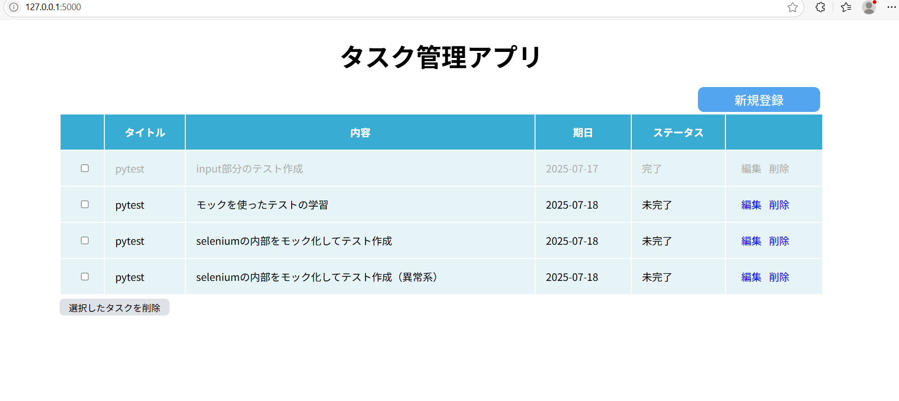
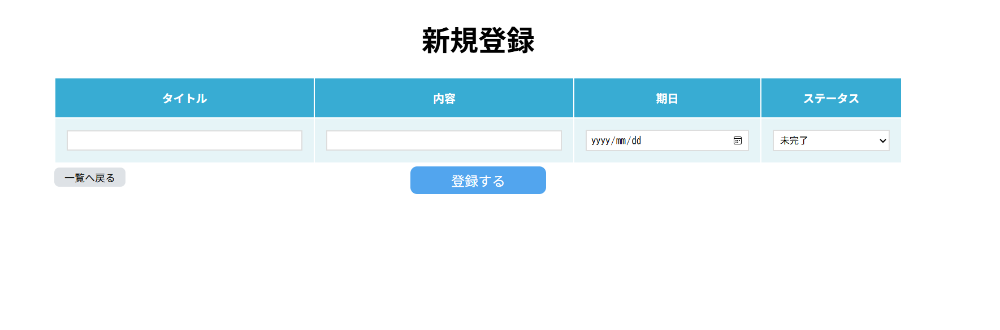
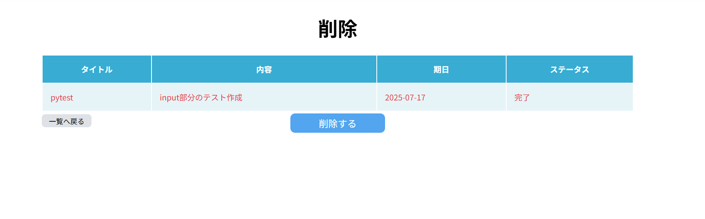
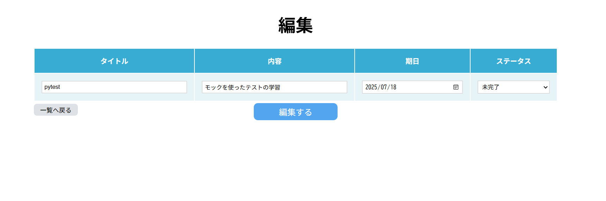
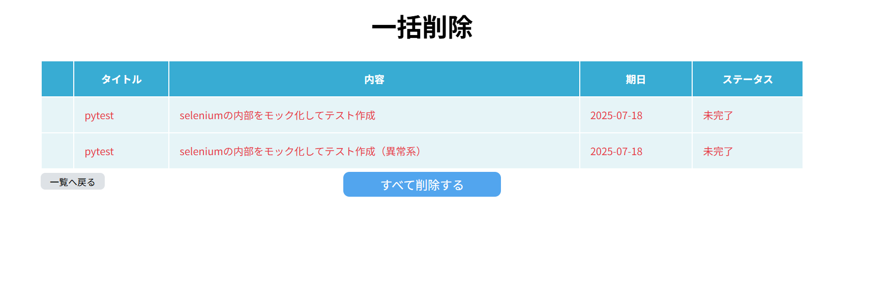

# シンプルなタスク管理アプリ

## 概要
タスクの新規登録、編集、削除、一括削除ができるタスク管理アプリです。データベースで管理しています。

## ディレクトリツリー
```
.
└──── task_app/
      ├── images/               # アプリの画像
      ├── static/      
      |    └──style.css         # アプリ全体のcss
      ├── templates/            
      |    ├── base.html        # html,headのベース
      |    ├── delete_all.html  # 一括削除画面
      |    ├── delete.html      # 削除画面
      |    ├── edit.html        # 編集画面
      |    ├── index.html       # TOP画面
      |    └── regist.html      # 新規登録画面
      |    
      ├── app.py             # アプリケーションのコアコード
      ├── .gitignore         # Gitで管理しないファイルやフォルダを指定
      ├── README.md          # このREADMEファイル
      └── requirements.txt   # プロジェクトで必要なPythonライブラリ
  ```

## 使用技術
- Python 3.x
- flask
- sqlite
- pytest（今後作成予定）


## 必要なライブラリ
requirements.txt を参照してください。

## 使い方
### 新規登録
    1.「新規登録」ボタンを押す
    2.新規登録画面でタスク名、内容、期限、ステータスを入力し、「登録する」ボタンを押す
### 削除
    1.「削除」を押す
    2.削除画面の内容を確認し、「削除する」ボタンを押す。
### 編集
    1.「編集」を押す
    2.編集画面で編集したい部分を変更し、「編集する」ボタンを押す
### 一括削除
    1.削除したいたすくをチェックし、「選択したタスクを削除」ボタンを押す
    2.一括削除画面の内容を確認し、「削除する」ボタンを押す

<!-- ## 機能一覧
    ・ブラウザの自動操作（Seleniumを使用）
    ・地域を指定してして情報を取得
    ・取得したデータを自動でExcelファイルに保存（openpyxl,pandasを使用）
    ・javaScriptでしか反応しなボタンにも対応
    ・pytestを使用した単体テスト（作成予定） -->

<!-- ## 作成理由・背景
このツールは就労移行支援事業所の訓練内容に、手作業でのデータ収集とExcel転記があり、その作業の効率化と自動化を目的として開発しました。 -->

## 工夫・強み
    ・永続的なデータ管理
    　→sqliteを使ってデータを管理しているため、ブラウザを閉じてもデータが消えません。

    ・UI・UXの工夫
    　→削除画面では文字の色を赤くしたり、完了済みのタスクは文字を薄くするなど、一目でわかりやすい工夫をした。
      →タスクを削除する際には、意図しない操作を防ぐために確認画面を挟むようにした。
      →戻るボタンを左側に配置したり、ボタンの色・大きさにコントラストをつけることで直感的に操作できるようにした。

    ・見た目のおしゃれさ
    　→全体の色合いが衝突しないように整えた

## 今後の目標
    ・pytestでテスト追加
    ・README.mdの充実

## スクリーンショット
・TOP画面

・新規登録画面

・削除画面

・編集画面

・一括削除画面



<!-- ## Youtubeアプリ全体のデモ動画
今後追加予定 -->
<!-- [](https://www.youtube.com/watch?v=dQw4w9WgXcQ) -->
<!-- [動画を見る](https://www.youtube.com/watch?v=動画ID) -->


