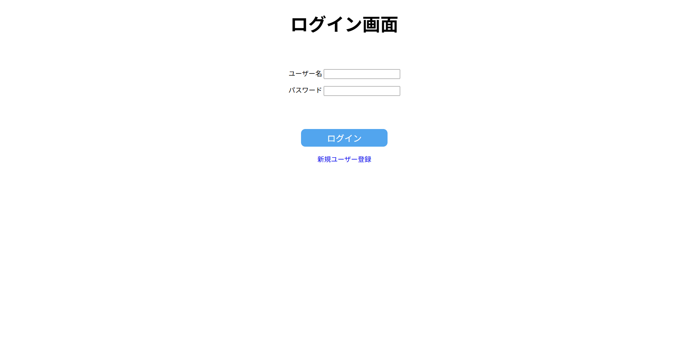
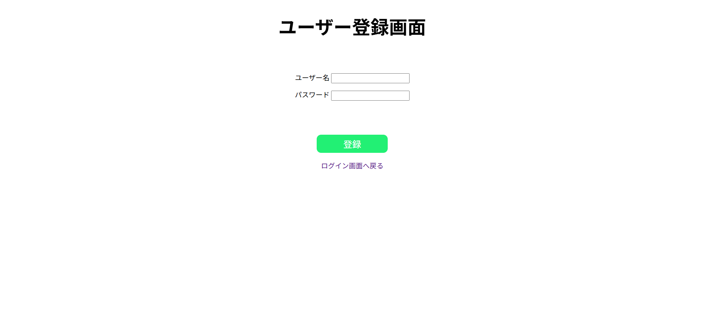
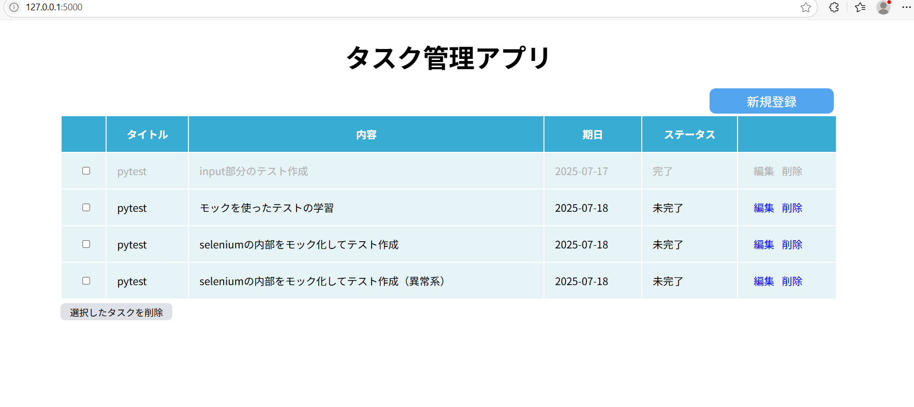
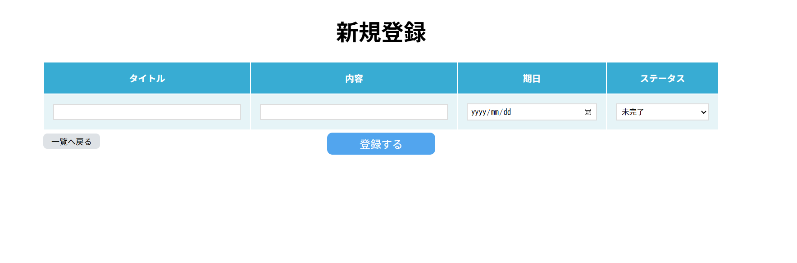
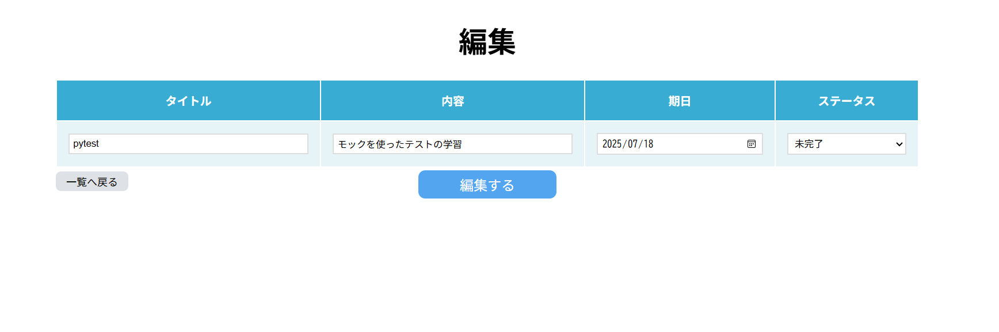

# Flask版 タスク管理アプリ

Flaskを使用したタスク管理Webアプリケーションです。学習目的でフロントエンドも含めた完全なWebアプリとして実装しました。\


## 目的

- Webアプリ開発の基礎理解
- httpリクエストの理解（GET/POST）
- htmlテンプレートエンジン（Jinja2）の使用
- CRUD操作の実装

## 機能

- タスクの新規登録
- タスクの編集
- タスクの削除
- 複数タスクの一括削除
- タスクの完了状態管理
- 直感的なWebインターフェース

## 技術スタック

Python\
Flask\
SQLite\
HTML/CSS\
Jinja2（テンプレートエンジン）

## ファイル構成

```python
flask_app/
├── images/               # アプリのスクリーンショット
├── static/      
│   └── style.css         # アプリ全体のCSS
├── templates/            
│   ├── base.html         # HTML/HEADのベーステンプレート
│   ├── delete_all.html   # 一括削除画面
│   ├── delete.html       # 削除確認画面
│   ├── edit.html         # 編集画面
│   ├── index.html        # TOP画面
│   ├── regist.html       # 新規登録画面
│   ├── login.html        # ログイン画面
│   └── signup.html       # 新規ユーザー登録画面
├── app.py                # アプリケーションのメインコード
├── .gitignore            # Git管理除外ファイル
├── README.md             # このファイル
└── requirements.txt      # 依存パッケージ
```

## セットアップ

### 依存パッケージのインストール

```bash
pip install -r ../requirements.txt
```

データベースは初回実行時に自動的に作成されます。

### 実行方法

```bash
flask run
```

アプリケーションが起動したら、ブラウザで以下のURLにアクセスしてください：\
<http://localhost:5000>

## 画面イメージ

- ログイン画面\

- ユーザー登録画面\

- TOP画面\

- 新規登録画面\

- 削除画面\

- 編集画面\

- 一括削除画面\


## 使い方

### 新規登録

1.「新規登録」ボタンを押す\
2.新規登録画面でタスク名、内容、期限、ステータスを入力し、「登録する」ボタンを押す

### 削除

1.「削除」を押す\
2.削除画面の内容を確認し、「削除する」ボタンを押す。

### 編集

1.「編集」を押す\
2.編集画面で編集したい部分を変更し、「編集する」ボタンを押す

### 一括削除

1.削除したいたすくをチェックし、「選択したタスクを削除」ボタンを押す\
2.一括削除画面の内容を確認し、「削除する」ボタンを押す

## 工夫した点・学んだこと

- HTTPリクエスト基本理解\
各処理にHTTPリクエスト処理のコメントを記載\
GET: サーバーからクライアントへ情報を返す（情報の取得）\
POST: クライアントからサーバーへの処理依頼(データベース操作)\
POST（例外）：　取得した情報をURLに乗せたくない場合（タスク複数削除）

- UI/UXの工夫\
・削除画面では文字を赤色にし、注意を促す\
・完了済みのタスクは文字を薄く表示し、視覚的に区別\
・タスク削除時には確認画面を挟み、誤操作を防止\
・戻るボタンを左側に配置し、直感的な操作を実現\
・ボタンの色や大きさにコントラストをつけ、操作性を向上\

- デザインの統一感\
全体の色合いが調和するよう配色を整え、見やすくなるよう工夫しました。

## 改善点・今後の課題

- 学習の姿勢\
学習が受動的になってしまった。動画を見て学習していたが、ほとんど模写に近くなってしまい、自分の力になっていない気がする。\
→~~学習の仕方について探求する~~
  - 解決済み(2025/11)
  1. １セクション動画を見る→何もみずに自分で手を動かす→つまずいたら動画に戻る
  2. 実践として、作り方が７割が他分かるものを作ってアウトプット（既存アプリの再構成や、簡単な他アプリの模倣）

- pytestの作成
- ~~README.mdの充実~~
